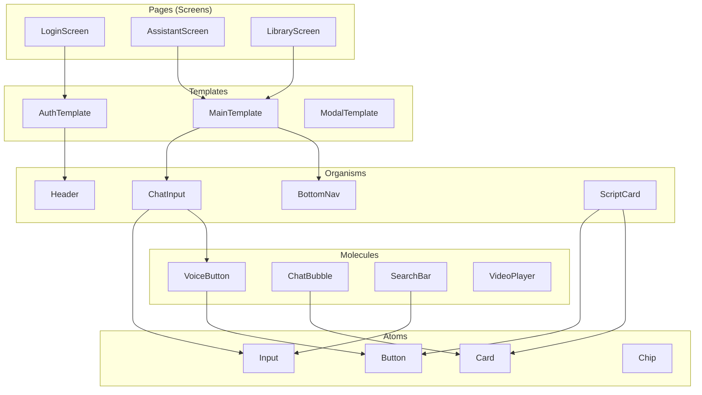
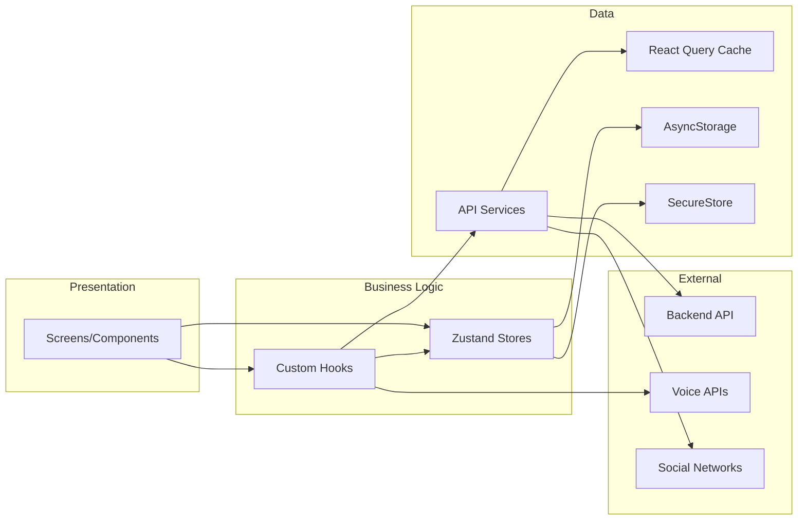
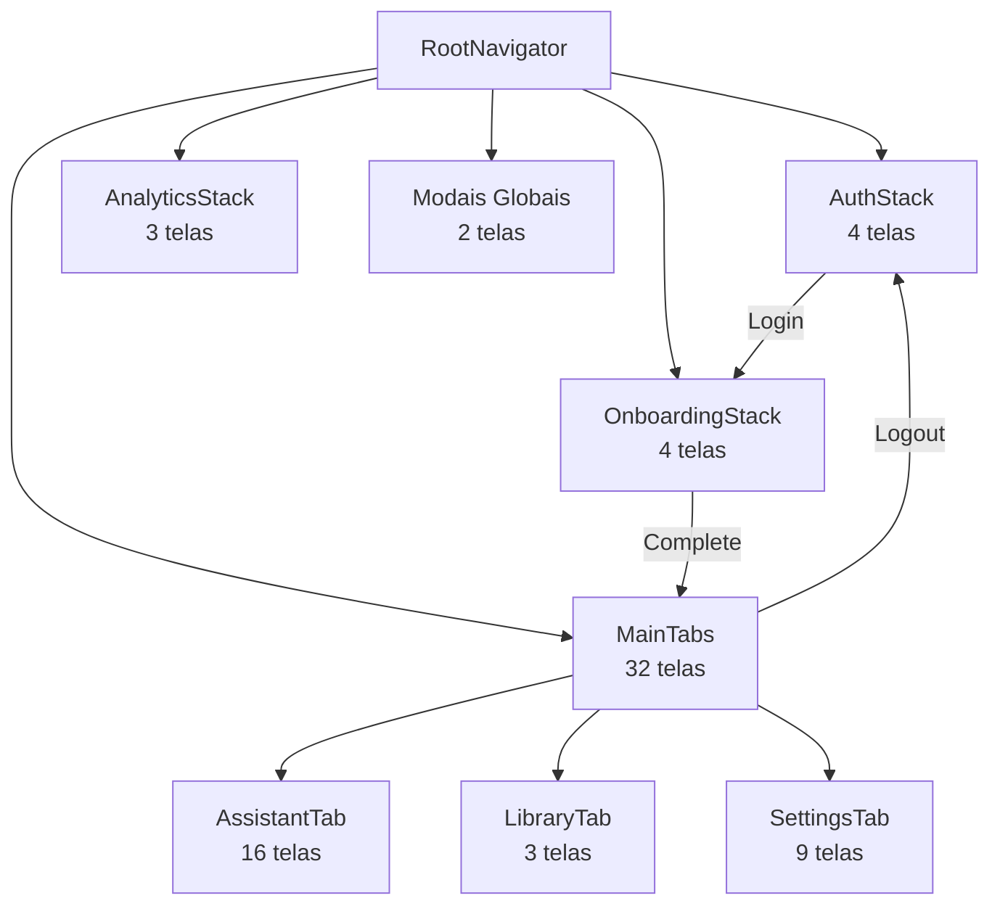
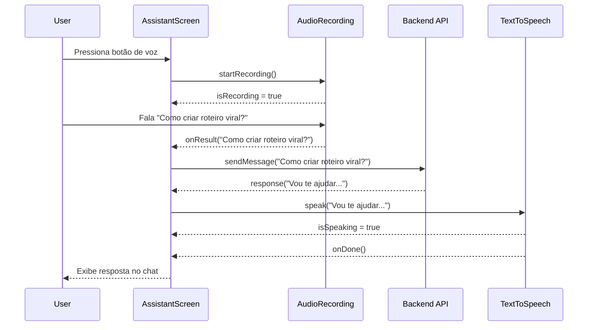
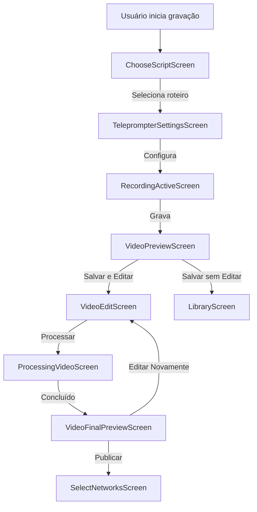

# Design Document - Fase 2: Conversão para React Native

## Introdução

Este documento especifica o design técnico completo para a conversão das 51 telas HTML/CSS geradas no Stitch para um aplicativo mobile funcional usando React Native + Expo.

**Contexto:**
- Fase 0 (Geração Stitch): ✅ CONCLUÍDA - 51 telas geradas e validadas
- Fase 1 (Backend): Será implementada em paralelo ou depois
- **Fase 2 (Frontend Mobile)**: ESTE DESIGN - Conversão para React Native + Expo

**Objetivo Principal:**
Criar um aplicativo mobile nativo (iOS e Android) com todas as 51 telas funcionais, navegação completa, componentes reutilizáveis, design system aplicado e integração com backend preparada.

**Documentos de Referência:**
- `.kiro/specs/fase-2-conversao-react-native/requirements.md` - 20 requirements aprovados
- `stitch-output/DESIGN.md` - Design System consolidado (100+ tokens)
- `stitch-output/COMPONENTS.md` - 35+ componentes documentados
- `stitch-output/NAVIGATION.md` - Navegação completa (51 telas, 4 stacks + Analytics)
- `stitch-output/CONVERSION-GUIDE.md` - Guia de conversão HTML → React Native
- `docs/5-ARQUITETURA-FRONTEND.md` - Arquitetura frontend detalhada

---

## Visão Geral

### Princípios de Design

1. **Mobile-First:** Otimizado para iOS e Android desde o início
2. **Componentização:** Máxima reutilização através de Atomic Design
3. **Type Safety:** TypeScript em 100% do código
4. **Performance:** Otimização de renderização e bundle size
5. **Acessibilidade:** WCAG 2.1 Level AA compliance
6. **Offline-First:** Funciona sem internet (modo degradado)
7. **Testabilidade:** Arquitetura que facilita testes automatizados

### Diferencial do Influency

- **Assistente IA Híbrido:** Interface conversacional com voz + texto
- **Teleprompter Inteligente:** Scroll sincronizado com fala
- **Edição Automática:** IA processa vídeos sem intervenção manual
- **Multi-Rede:** Publicação simultânea em múltiplas plataformas

---

## Arquitetura

### Stack Tecnológico

#### Core
- **React Native:** 0.73+ - Framework mobile cross-platform
- **Expo:** 50+ (SDK) - Toolchain e serviços gerenciados
- **TypeScript:** 5.0+ - Linguagem com tipagem estática
- **Node.js:** 18+ LTS - Runtime JavaScript

#### UI & Styling
- **React Native Paper:** 5.x - Componentes Material Design 3
- **Lucide React Native:** Biblioteca de ícones
- **React Native Reanimated:** 3.x - Animações performáticas (thread nativo)
- **React Native Gesture Handler:** Gestos touch otimizados

#### Navegação
- **Expo Router:** File-based routing (baseado em React Navigation 6.x)
- **React Navigation:** 6.x - Stack, Tabs, Modal navigators

#### Mídia & Câmera
- **Expo AV:** Reprodução de vídeo/áudio
- **Expo Camera:** Gravação de vídeo com controles nativos
- **Expo Image Picker:** Seleção de imagens da galeria
- **@siteed/expo-audio-studio:** Gravação e reconhecimento de voz (Speech-to-Text)
- **expo-speech:** Síntese de voz (Text-to-Speech)

#### Estado & Dados
- **Zustand:** Estado global leve e performático
- **React Query (TanStack Query):** Server state management e cache
- **AsyncStorage:** Persistência local de dados não sensíveis
- **SecureStore:** Armazenamento criptografado de tokens

#### Networking
- **Axios:** HTTP client com interceptors
- **Socket.io:** WebSocket para comunicação em tempo real (futuro)

#### Formulários & Validação
- **React Hook Form:** Gerenciamento de formulários
- **Zod:** Validação de schemas TypeScript-first

#### Testes
- **Jest:** Test runner
- **React Native Testing Library:** Testes de componentes
- **@testing-library/react-hooks:** Testes de hooks customizados

### Arquitetura de Camadas

```
┌─────────────────────────────────────────────────────────────┐
│                      PRESENTATION LAYER                     │
│  (Screens, Components, Navigation)                          │
│  - 51 telas organizadas em stacks                           │
│  - 35+ componentes reutilizáveis (Atomic Design)            │
│  - Navegação file-based com Expo Router                     │
└─────────────────────────────────────────────────────────────┘
                            │
                            ▼
┌─────────────────────────────────────────────────────────────┐
│                      BUSINESS LOGIC LAYER                   │
│  (Hooks, Stores, Services)                                  │
│  - Custom hooks para lógica reutilizável                    │
│  - Zustand stores para estado global                        │
│  - Services para comunicação com backend                    │
└─────────────────────────────────────────────────────────────┘
                            │
                            ▼
┌─────────────────────────────────────────────────────────────┐
│                      DATA LAYER                             │
│  (API Client, Cache, Storage)                               │
│  - Axios client com interceptors                            │
│  - React Query para cache de servidor                       │
│  - AsyncStorage/SecureStore para persistência               │
└─────────────────────────────────────────────────────────────┘
                            │
                            ▼
┌─────────────────────────────────────────────────────────────┐
│                      EXTERNAL SERVICES                      │
│  (Backend API, Voice APIs, Social Networks)                 │
│  - FastAPI backend (Fase 1)                                 │
│  - APIs de reconhecimento de voz                            │
│  - APIs de redes sociais (OAuth)                            │
└─────────────────────────────────────────────────────────────┘
```

### Padrões Arquiteturais

#### 1. Atomic Design (Componentização)

Organização de componentes em níveis de complexidade crescente:

- **Átomos:** Componentes básicos indivisíveis (Button, Input, Card, Chip, Badge)
- **Moléculas:** Combinações simples de átomos (VoiceButton, ChatBubble, SearchBar)
- **Organismos:** Componentes complexos (Header, BottomNav, ChatInput, ScriptCard)
- **Templates:** Layouts de tela completos (AuthTemplate, MainTemplate, ModalTemplate)
- **Pages:** Telas específicas que usam templates (LoginScreen, AssistantScreen)

#### 2. Container/Presenter Pattern

Separação entre lógica e apresentação:

- **Containers (Screens):** Gerenciam estado e lógica de negócio
- **Presenters (Components):** Apenas renderização, recebem props

Exemplo:
```typescript
// Container (Screen)
export default function AssistantScreen() {
  const { messages, addMessage } = useAssistantStore();
  const { startRecording } = useAudioRecording();
  
  const handleSend = (text: string) => {
    addMessage({ role: 'user', content: text });
    // Lógica de negócio
  };
  
  return <AssistantView messages={messages} onSend={handleSend} />;
}

// Presenter (Component)
function AssistantView({ messages, onSend }) {
  return (
    <View>
      {messages.map(msg => <ChatBubble message={msg} />)}
      <ChatInput onSend={onSend} />
    </View>
  );
}
```

#### 3. Custom Hooks Pattern

Encapsulamento de lógica reutilizável:

- `useAudioRecording()` - Gravação e reconhecimento de voz
- `useTextToSpeech()` - Síntese de voz
- `useCamera()` - Controle de câmera
- `useAuth()` - Autenticação
- `useScripts()` - Gerenciamento de roteiros

#### 4. Service Layer Pattern

Abstração de comunicação com backend:

```typescript
// src/services/scripts.ts
export const scriptsService = {
  list: () => api.get('/scripts'),
  generate: (topic: string) => api.post('/scripts/generate', { topic }),
  update: (id: string, data: any) => api.put(`/scripts/${id}`, data),
  delete: (id: string) => api.delete(`/scripts/${id}`),
};
```

---

## Componentes e Interfaces

### Estrutura de Pastas

```
influency-mobile/
├── app/                          # Expo Router (file-based routing)
│   ├── (auth)/                   # Auth Stack (4 telas)
│   │   ├── _layout.tsx
│   │   ├── splash.tsx
│   │   ├── login.tsx
│   │   ├── register.tsx
│   │   └── forgot-password.tsx
│   ├── (onboarding)/             # Onboarding Stack (4 telas)
│   │   ├── _layout.tsx
│   │   ├── welcome.tsx
│   │   ├── business-dna.tsx
│   │   ├── connect-social.tsx
│   │   └── complete.tsx
│   ├── (tabs)/                   # Main App (Bottom Tabs - 32 telas)
│   │   ├── _layout.tsx
│   │   ├── assistant/            # AssistantTab (16 telas)
│   │   ├── library/              # LibraryTab (3 telas)
│   │   └── settings/             # SettingsTab (9 telas + 3 Assets)
│   ├── modals/                   # Modais Globais (2 telas)
│   │   ├── script-generation.tsx
│   │   └── edit-script.tsx
│   ├── analytics/                # Analytics Stack (3 telas)
│   │   ├── index.tsx
│   │   ├── post-details.tsx
│   │   └── url-analysis.tsx
│   └── _layout.tsx               # Root layout
├── src/
│   ├── components/               # Componentes reutilizáveis
│   │   ├── atoms/                # 14 componentes básicos
│   │   │   ├── Button.tsx
│   │   │   ├── Input.tsx
│   │   │   ├── Card.tsx
│   │   │   ├── Chip.tsx
│   │   │   ├── Badge.tsx
│   │   │   ├── Avatar.tsx
│   │   │   ├── Icon.tsx
│   │   │   ├── Loading.tsx
│   │   │   ├── ProgressBar.tsx
│   │   │   ├── Switch.tsx
│   │   │   ├── Checkbox.tsx
│   │   │   ├── Radio.tsx
│   │   │   ├── Slider.tsx
│   │   │   └── Divider.tsx
│   │   ├── molecules/            # 10 componentes compostos
│   │   │   ├── VoiceButton.tsx
│   │   │   ├── ChatBubble.tsx
│   │   │   ├── VideoPlayer.tsx
│   │   │   ├── TeleprompterView.tsx
│   │   │   ├── SearchBar.tsx
│   │   │   ├── DateTimePicker.tsx
│   │   │   ├── TagInput.tsx
│   │   │   ├── ColorPicker.tsx
│   │   │   ├── SocialNetworkCard.tsx
│   │   │   └── MetricCard.tsx
│   │   └── organisms/            # 11 componentes complexos
│   │       ├── Header.tsx
│   │       ├── BottomNavigationBar.tsx
│   │       ├── ChatInput.tsx
│   │       ├── ScriptCard.tsx
│   │       ├── VideoCard.tsx
│   │       ├── CarouselCard.tsx
│   │       ├── PostCard.tsx
│   │       ├── SettingsItem.tsx
│   │       ├── AssetCard.tsx
│   │       ├── ChartCard.tsx
│   │       └── FAB.tsx
│   ├── hooks/                    # Custom hooks
│   │   ├── useAudioRecording.ts
│   │   ├── useTextToSpeech.ts
│   │   ├── useCamera.ts
│   │   ├── useAuth.ts
│   │   ├── useScripts.ts
│   │   ├── useVideos.ts
│   │   └── useTheme.ts
│   ├── services/                 # API services
│   │   ├── api.ts                # Axios client
│   │   ├── auth.ts               # Autenticação
│   │   ├── scripts.ts            # Scripts API
│   │   ├── videos.ts             # Videos API
│   │   ├── posts.ts              # Posts API
│   │   └── carousels.ts          # Carousels API
│   ├── store/                    # Zustand stores
│   │   ├── authStore.ts          # Estado de autenticação
│   │   ├── assistantStore.ts     # Estado do assistente
│   │   ├── scriptStore.ts        # Estado de roteiros
│   │   └── videoStore.ts         # Estado de vídeos
│   ├── types/                    # TypeScript types
│   │   ├── index.ts
│   │   ├── navigation.ts
│   │   ├── api.ts
│   │   └── models.ts
│   ├── utils/                    # Utilitários
│   │   ├── validation.ts
│   │   ├── formatting.ts
│   │   └── constants.ts
│   └── theme/                    # Design system
│       ├── colors.ts             # Paleta de cores
│       ├── typography.ts         # Escala tipográfica
│       ├── spacing.ts            # Espaçamento
│       ├── borderRadius.ts       # Border radius
│       └── index.ts              # Export consolidado
└── assets/                       # Assets estáticos
    ├── images/
    ├── fonts/
    └── sounds/
```

### Componentes Principais

#### 1. Átomos (14 componentes)

**Button**
```typescript
interface ButtonProps {
  variant: 'primary' | 'secondary' | 'outline' | 'text' | 'icon';
  size?: 'small' | 'medium' | 'large';
  disabled?: boolean;
  loading?: boolean;
  icon?: ReactNode;
  onPress: () => void;
  children: ReactNode;
}
```

**Input**
```typescript
interface InputProps {
  type: 'text' | 'password' | 'email' | 'multiline';
  placeholder?: string;
  value: string;
  onChangeText: (text: string) => void;
  error?: string;
  disabled?: boolean;
  icon?: ReactNode;
  maxLength?: number;
  rows?: number;
}
```

**Card**
```typescript
interface CardProps {
  variant: 'elevated' | 'outlined' | 'filled';
  padding?: number;
  onPress?: () => void;
  children: ReactNode;
}
```

#### 2. Moléculas (10 componentes)

**VoiceButton**
```typescript
interface VoiceButtonProps {
  recording: boolean;
  onPress: () => void;
  disabled?: boolean;
}
```

**ChatBubble**
```typescript
interface ChatBubbleProps {
  type: 'user' | 'assistant';
  message: string;
  timestamp?: string;
  avatar?: string;
}
```

**TeleprompterView**
```typescript
interface TeleprompterViewProps {
  text: string;
  scrollSpeed: number; // pixels por segundo
  fontSize: number;
  scrollMode: 'auto' | 'manual' | 'voice';
  onScrollEnd?: () => void;
}
```

#### 3. Organismos (11 componentes)

**Header**
```typescript
interface HeaderProps {
  title: string;
  subtitle?: string;
  leftAction?: ReactNode;
  rightAction?: ReactNode;
  onBack?: () => void;
}
```

**ChatInput**
```typescript
interface ChatInputProps {
  value: string;
  onChangeText: (text: string) => void;
  onSend: () => void;
  onVoicePress: () => void;
  recording?: boolean;
  disabled?: boolean;
}
```

**ScriptCard**
```typescript
interface ScriptCardProps {
  title: string;
  content: string;
  wordCount: number;
  duration: number;
  createdAt: string;
  onEdit?: () => void;
  onDelete?: () => void;
  onUse?: () => void;
}
```

### Navegação

#### Estrutura de Navegação (51 telas)

```
RootNavigator (Stack)
├── AuthStack (4 telas)
│   ├── Splash
│   ├── Login
│   ├── Register
│   └── ForgotPassword
│
├── OnboardingStack (4 telas)
│   ├── Welcome
│   ├── BusinessDNA (5 perguntas)
│   ├── ConnectSocialNetworks
│   └── OnboardingComplete
│
├── MainTabs (Bottom Tabs - 32 telas)
│   ├── AssistantTab (16 telas)
│   │   ├── Assistant (chat híbrido)
│   │   ├── ConversationHistory
│   │   ├── AssistantSettings
│   │   ├── GeneratingScript (loading)
│   │   ├── ScriptGenerated
│   │   ├── ChooseScript
│   │   ├── TeleprompterSettings
│   │   ├── RecordingActive (fullscreen)
│   │   ├── VideoPreview
│   │   ├── VideoEdit
│   │   ├── ProcessingVideo (loading)
│   │   ├── VideoFinalPreview
│   │   ├── CarouselGeneration
│   │   ├── GeneratingCarousel (loading)
│   │   ├── CarouselPreview
│   │   └── SubtitlesCustomization (modal)
│   │
│   ├── LibraryTab (3 telas)
│   │   ├── Library (tabs internas)
│   │   ├── SavedScripts
│   │   ├── SavedVideos
│   │   └── SavedCarousels
│   │
│   └── SettingsTab (9 telas)
│       ├── Settings
│       ├── Profile
│       ├── BusinessDNASettings
│       ├── SocialAccounts
│       ├── BrandAssets
│       ├── UploadAsset (modal)
│       ├── ConfigureAsset (modal)
│       ├── NotificationsSettings
│       └── Integrations
│
├── AnalyticsStack (3 telas)
│   ├── Analytics
│   ├── PostDetails
│   └── URLAnalysis (modal)
│
└── Modais Globais (2 telas)
    ├── ScriptGeneration (modal)
    └── EditScript (modal)
```

#### Tipos de Navegação

```typescript
// src/types/navigation.ts
export type RootStackParamList = {
  Auth: undefined;
  Onboarding: undefined;
  Main: undefined;
  Analytics: undefined;
  PostDetails: { postId: string };
  URLAnalysis: { url?: string };
  ScriptGeneration: undefined;
  EditScript: { scriptId: string };
};

export type AuthStackParamList = {
  Splash: undefined;
  Login: undefined;
  Register: undefined;
  ForgotPassword: undefined;
};

export type MainTabsParamList = {
  AssistantTab: undefined;
  LibraryTab: undefined;
  SettingsTab: undefined;
};

export type AssistantStackParamList = {
  Assistant: undefined;
  ConversationHistory: undefined;
  AssistantSettings: undefined;
  GeneratingScript: { topic: string };
  ScriptGenerated: { scriptId: string };
  ChooseScript: undefined;
  TeleprompterSettings: { scriptId: string };
  RecordingActive: { scriptId: string; settings: TeleprompterSettings };
  VideoPreview: { videoId: string };
  VideoEdit: { videoId: string };
  ProcessingVideo: { videoId: string };
  VideoFinalPreview: { videoId: string };
  CarouselGeneration: undefined;
  GeneratingCarousel: { topic: string };
  CarouselPreview: { carouselId: string };
  SubtitlesCustomization: { videoId: string };
};
```

---

## Data Models

### Modelos de Dados TypeScript

#### User
```typescript
interface User {
  id: string;
  email: string;
  name: string;
  avatar?: string;
  createdAt: Date;
  businessDNA?: BusinessDNA;
}

interface BusinessDNA {
  niche: string;
  targetAudience: string;
  toneOfVoice: string;
  objectives: string[];
  differentials: string[];
}
```

#### Script
```typescript
interface Script {
  id: string;
  userId: string;
  title: string;
  content: string;
  wordCount: number;
  duration: number; // segundos
  createdAt: Date;
  updatedAt: Date;
}

interface ScriptGenerationRequest {
  topic: string;
  duration: number; // 30-300 segundos
  tone?: string;
}
```

#### Video
```typescript
interface Video {
  id: string;
  userId: string;
  scriptId?: string;
  title?: string;
  url: string;
  thumbnail: string;
  duration: number;
  status: 'recording' | 'processing' | 'ready' | 'error';
  settings: VideoSettings;
  createdAt: Date;
  updatedAt: Date;
}

interface VideoSettings {
  subtitles: boolean;
  music: boolean;
  assets: boolean;
  autoCuts: boolean;
  subtitleStyle?: string;
  cutMode?: string;
  musicVolume?: number;
}

interface TeleprompterSettings {
  scrollMode: 'auto' | 'manual' | 'voice';
  scrollSpeed: number; // pixels por segundo
  fontSize: number;
}
```

#### Carousel
```typescript
interface Carousel {
  id: string;
  userId: string;
  title: string;
  slides: Slide[];
  createdAt: Date;
  updatedAt: Date;
}

interface Slide {
  id: string;
  order: number;
  imageUrl: string;
  text?: string;
}
```

#### Post
```typescript
interface Post {
  id: string;
  userId: string;
  contentId: string; // videoId ou carouselId
  contentType: 'video' | 'carousel';
  caption: string;
  hashtags: string[];
  networks: SocialNetwork[];
  status: 'draft' | 'scheduled' | 'published' | 'failed';
  scheduledAt?: Date;
  publishedAt?: Date;
  metrics?: PostMetrics;
}

type SocialNetwork = 'instagram' | 'tiktok' | 'facebook' | 'youtube' | 'linkedin';

interface PostMetrics {
  views: number;
  likes: number;
  comments: number;
  shares: number;
  reach?: number;
  impressions?: number;
  viralScore?: number; // 0-100
}
```

#### SocialAccount
```typescript
interface SocialAccount {
  id: string;
  userId: string;
  network: SocialNetwork;
  username: string;
  avatar: string;
  connected: boolean;
  accessToken?: string;
  refreshToken?: string;
  expiresAt?: Date;
}
```

#### BrandAsset
```typescript
interface BrandAsset {
  id: string;
  userId: string;
  type: 'logo' | 'intro' | 'outro' | 'watermark';
  url: string;
  settings: AssetSettings;
  configured: boolean;
}

interface AssetSettings {
  position?: 'top-left' | 'top-right' | 'bottom-left' | 'bottom-right' | 'center';
  opacity?: number; // 0-100
  duration?: number; // segundos (para intro/outro)
  autoApply?: boolean;
}
```

#### Message (Assistente IA)
```typescript
interface Message {
  id: string;
  conversationId: string;
  role: 'user' | 'assistant';
  content: string;
  mode: 'voice' | 'text';
  timestamp: Date;
}

interface Conversation {
  id: string;
  userId: string;
  messages: Message[];
  createdAt: Date;
  updatedAt: Date;
}
```

### Estado Global (Zustand Stores)

#### Auth Store
```typescript
interface AuthState {
  user: User | null;
  isAuthenticated: boolean;
  login: (email: string, password: string) => Promise<void>;
  register: (name: string, email: string, password: string) => Promise<void>;
  logout: () => Promise<void>;
  loadAuth: () => Promise<void>;
  updateProfile: (data: Partial<User>) => Promise<void>;
}
```

#### Assistant Store
```typescript
interface AssistantState {
  messages: Message[];
  isListening: boolean;
  isSpeaking: boolean;
  addMessage: (message: Omit<Message, 'id' | 'timestamp'>) => void;
  clearMessages: () => void;
  setListening: (listening: boolean) => void;
  setSpeaking: (speaking: boolean) => void;
}
```

#### Script Store
```typescript
interface ScriptState {
  scripts: Script[];
  currentScript: Script | null;
  setCurrentScript: (script: Script | null) => void;
  addScript: (script: Script) => void;
  updateScript: (id: string, data: Partial<Script>) => void;
  deleteScript: (id: string) => void;
}
```

#### Video Store
```typescript
interface VideoState {
  videos: Video[];
  currentVideo: Video | null;
  setCurrentVideo: (video: Video | null) => void;
  addVideo: (video: Video) => void;
  updateVideo: (id: string, data: Partial<Video>) => void;
  deleteVideo: (id: string) => void;
}
```

### API Responses

#### Success Response
```typescript
interface ApiResponse<T> {
  success: true;
  data: T;
  message?: string;
}
```

#### Error Response
```typescript
interface ApiError {
  success: false;
  error: {
    code: string;
    message: string;
    details?: any;
  };
}
```

#### Paginated Response
```typescript
interface PaginatedResponse<T> {
  success: true;
  data: T[];
  pagination: {
    page: number;
    pageSize: number;
    total: number;
    totalPages: number;
  };
}
```

---

## Error Handling

### Estratégia de Tratamento de Erros

#### 1. Categorias de Erros

**Erros de Rede**
- Sem conexão com internet
- Timeout de requisição
- Erro de servidor (5xx)

**Erros de Validação**
- Dados inválidos do usuário
- Formato incorreto
- Campos obrigatórios faltando

**Erros de Autenticação**
- Token expirado
- Credenciais inválidas
- Sem permissão

**Erros de Negócio**
- Recurso não encontrado
- Operação não permitida
- Limite excedido

#### 2. Tratamento por Camada

**API Client (Axios Interceptors)**
```typescript
// src/services/api.ts
api.interceptors.response.use(
  (response) => response,
  async (error) => {
    // Refresh token automático em 401
    if (error.response?.status === 401 && !error.config._retry) {
      error.config._retry = true;
      try {
        const refreshToken = await SecureStore.getItemAsync('refresh_token');
        const response = await axios.post('/auth/refresh', { refresh_token: refreshToken });
        await SecureStore.setItemAsync('access_token', response.data.access_token);
        error.config.headers.Authorization = `Bearer ${response.data.access_token}`;
        return api(error.config);
      } catch (refreshError) {
        // Logout se refresh falhar
        await authStore.logout();
        throw refreshError;
      }
    }
    
    // Detectar offline
    const netInfo = await NetInfo.fetch();
    if (!netInfo.isConnected) {
      throw new NetworkError('Sem conexão. Verifique sua internet.');
    }
    
    // Erro genérico
    throw new ApiError(error.response?.data?.error || 'Erro desconhecido');
  }
);
```

**Services Layer**
```typescript
// src/services/scripts.ts
export const scriptsService = {
  async generate(topic: string): Promise<Script> {
    try {
      const response = await api.post('/scripts/generate', { topic });
      return response.data.data;
    } catch (error) {
      if (error instanceof NetworkError) {
        // Adicionar à fila de sincronização
        await syncQueue.add({ action: 'generate_script', data: { topic } });
        throw new Error('Sem conexão. Roteiro será gerado quando voltar online.');
      }
      throw error;
    }
  },
};
```

**Screens/Components**
```typescript
// src/screens/scripts/ScriptGenerationScreen.tsx
export default function ScriptGenerationScreen() {
  const [error, setError] = useState<string | null>(null);
  const generateMutation = useGenerateScript();
  
  const handleGenerate = async () => {
    try {
      setError(null);
      await generateMutation.mutateAsync(topic);
      router.push('/assistant/script-generated');
    } catch (error) {
      if (error instanceof NetworkError) {
        setError('Sem conexão. Tente novamente quando estiver online.');
      } else if (error instanceof ValidationError) {
        setError('Por favor, preencha todos os campos corretamente.');
      } else {
        setError('Erro ao gerar roteiro. Tente novamente.');
      }
    }
  };
  
  return (
    <View>
      {error && <ErrorBanner message={error} onDismiss={() => setError(null)} />}
      {/* ... */}
    </View>
  );
}
```

#### 3. Feedback Visual

**Toast/Snackbar para erros temporários**
```typescript
import { Snackbar } from 'react-native-paper';

<Snackbar
  visible={!!error}
  onDismiss={() => setError(null)}
  duration={3000}
  action={{
    label: 'Tentar novamente',
    onPress: handleRetry,
  }}
>
  {error}
</Snackbar>
```

**Modal para erros críticos**
```typescript
import { Dialog, Portal } from 'react-native-paper';

<Portal>
  <Dialog visible={!!criticalError} onDismiss={handleDismiss}>
    <Dialog.Title>Erro</Dialog.Title>
    <Dialog.Content>
      <Text>{criticalError}</Text>
    </Dialog.Content>
    <Dialog.Actions>
      <Button onPress={handleDismiss}>OK</Button>
    </Dialog.Actions>
  </Dialog>
</Portal>
```

**Inline errors para formulários**
```typescript
<Input
  label="Email"
  value={email}
  onChangeText={setEmail}
  error={emailError}
/>
```

#### 4. Logging e Monitoramento

**Sentry para produção**
```typescript
import * as Sentry from '@sentry/react-native';

Sentry.init({
  dsn: process.env.EXPO_PUBLIC_SENTRY_DSN,
  environment: __DEV__ ? 'development' : 'production',
});

// Capturar erros
try {
  // código
} catch (error) {
  Sentry.captureException(error);
  throw error;
}
```

**Console.log para desenvolvimento**
```typescript
if (__DEV__) {
  console.error('Error generating script:', error);
}
```

---

## Testing Strategy

### Abordagem de Testes

O projeto utilizará **testes unitários** para garantir qualidade do código nos componentes base e hooks customizados.

#### Testes Unitários

**Objetivo:** Verificar exemplos específicos, casos extremos e condições de erro.

**Ferramentas:**
- Jest como test runner
- React Native Testing Library para testes de componentes
- @testing-library/react-hooks para testes de hooks

**Foco:**
- Componentes base (átomos)
- Hooks customizados
- Exemplos concretos de comportamento correto
- Casos extremos e condições de erro
- Validação de UI (snapshots)

**Exemplo:**
```typescript
// src/components/atoms/Button.test.tsx
import { render, fireEvent } from '@testing-library/react-native';
import Button from './Button';

describe('Button', () => {
  it('should render with primary variant', () => {
    const { getByText } = render(
      <Button variant="primary" onPress={() => {}}>
        Click me
      </Button>
    );
    expect(getByText('Click me')).toBeTruthy();
  });
  
  it('should call onPress when clicked', () => {
    const onPress = jest.fn();
    const { getByText } = render(
      <Button variant="primary" onPress={onPress}>
        Click me
      </Button>
    );
    fireEvent.press(getByText('Click me'));
    expect(onPress).toHaveBeenCalledTimes(1);
  });
  
  it('should not call onPress when disabled', () => {
    const onPress = jest.fn();
    const { getByText } = render(
      <Button variant="primary" onPress={onPress} disabled>
        Click me
      </Button>
    );
    fireEvent.press(getByText('Click me'));
    expect(onPress).not.toHaveBeenCalled();
  });
});
```

### Estrutura de Testes

```
src/
├── components/
│   ├── atoms/
│   │   ├── Button.tsx
│   │   └── Button.test.tsx
│   ├── molecules/
│   │   ├── VoiceButton.tsx
│   │   └── VoiceButton.test.tsx
│   └── organisms/
│       ├── ChatInput.tsx
│       └── ChatInput.test.tsx
├── hooks/
│   ├── useAudioRecording.ts
│   └── useAudioRecording.test.ts
├── services/
│   ├── api.ts
│   └── api.test.ts
├── store/
│   ├── authStore.ts
│   └── authStore.test.ts
└── utils/
    ├── validation.ts
    └── validation.test.ts
```

### Comandos de Teste

```bash
# Executar todos os testes
npm test

# Executar em modo watch
npm test -- --watch

# Executar testes específicos
npm test Button.test.tsx
```

### Testes de Snapshot

Para componentes visuais, usar snapshots para detectar mudanças não intencionais:

```typescript
it('should match snapshot', () => {
  const { toJSON } = render(
    <Button variant="primary" onPress={() => {}}>
      Click me
    </Button>
  );
  expect(toJSON()).toMatchSnapshot();
});
```

### Mocks e Fixtures

**Mocks de APIs:**
```typescript
// src/__mocks__/api.ts
export const api = {
  get: jest.fn(),
  post: jest.fn(),
  put: jest.fn(),
  delete: jest.fn(),
};
```

**Fixtures de dados:**
```typescript
// src/__fixtures__/user.ts
export const mockUser: User = {
  id: '123',
  email: 'test@example.com',
  name: 'Test User',
  createdAt: new Date('2026-01-01'),
};
```

**Nota:** Testes de integração, E2E e métricas de cobertura são considerados pós-MVP e serão implementados em fases futuras.

---

## Correctness Properties

*Uma propriedade é uma característica ou comportamento que deve ser verdadeiro em todas as execuções válidas de um sistema - essencialmente, uma declaração formal sobre o que o sistema deve fazer. As propriedades servem como ponte entre especificações legíveis por humanos e garantias de correção verificáveis por máquina.*

### Property 1: Configuração do Design System

*Para qualquer* token do design system (cor, tipografia, espaçamento, border radius), o valor definido deve corresponder exatamente ao especificado em `stitch-output/DESIGN.md`.

**Validates: Requirements 2.1, 2.2, 2.3, 2.4**

### Property 2: Espaçamento baseado em múltiplos de 8px

*Para qualquer* valor de espaçamento definido no design system, o valor deve ser múltiplo de 4 ou 8.

**Validates: Requirements 2.3**

### Property 3: Sombras multiplataforma

*Para qualquer* componente com elevação, deve ter propriedades de sombra para iOS (shadowColor, shadowOffset, shadowOpacity, shadowRadius) E propriedades para Android (elevation).

**Validates: Requirements 2.5**

### Property 4: Consistência de estilos com Design System

*Para qualquer* componente que usa tokens do design system, os estilos aplicados devem usar os valores dos tokens (não valores hardcoded).

**Validates: Requirements 2.8**

### Property 5: Props tipadas com TypeScript

*Para qualquer* componente, passar props com tipos incorretos deve resultar em erro de compilação TypeScript.

**Validates: Requirements 3.8**

### Property 6: Acessibilidade em componentes interativos

*Para qualquer* componente interativo (botão, input, link), deve ter `accessibilityLabel` e, quando necessário, `accessibilityHint` definidos.

**Validates: Requirements 3.10, 18.1, 18.2**

### Property 7: Navegação condicional baseada em autenticação

*Para qualquer* estado de autenticação, se `isAuthenticated === false`, o sistema deve renderizar AuthStack; se `isAuthenticated === true`, o sistema deve renderizar MainStack.

**Validates: Requirements 4.10, 4.11**

### Property 8: Preservação de estado na navegação

*Para qualquer* navegação (push → back), o estado da tela anterior deve ser preservado (valores de inputs, scroll position, etc.).

**Validates: Requirements 4.12**

### Property 9: Deep links válidos

*Para qualquer* deep link no formato `influency://[rota]`, se a rota é válida, o sistema deve navegar para a tela correspondente.

**Validates: Requirements 4.13**

### Property 10: Validação de email

*Para qualquer* string que não corresponde ao formato de email válido (regex: `/^[^\s@]+@[^\s@]+\.[^\s@]+$/`), a validação deve falhar.

**Validates: Requirements 5.2**

### Property 11: Feedback de erro em validação

*Para qualquer* erro de validação em formulário, uma mensagem de erro deve ser exibida ao usuário.

**Validates: Requirements 5.3**

### Property 12: Progress bar do onboarding

*Para qualquer* pergunta do onboarding (1-5), a progress bar deve mostrar o progresso correto: pergunta N deve mostrar (N/5 * 100)%.

**Validates: Requirements 6.2**

### Property 13: Modo de input híbrido

*Para qualquer* pergunta do onboarding ou mensagem do assistente, o usuário deve poder responder tanto por voz quanto por texto.

**Validates: Requirements 6.3, 7.10**

### Property 14: Reconhecimento de voz ativa transcrição

*Para qualquer* pressão do botão de microfone quando não está gravando, o reconhecimento de voz deve iniciar; quando já está gravando, deve parar.

**Validates: Requirements 7.4, 7.6**

### Property 15: Resposta do assistente em áudio condicional

*Para qualquer* mensagem do usuário, SE o modo de entrada foi voz, ENTÃO a resposta do assistente deve ser reproduzida em áudio (TTS); SE foi texto, ENTÃO apenas exibir no chat.

**Validates: Requirements 7.9**

### Property 16: Indicadores visuais de estado do assistente

*Para qualquer* estado do assistente (ouvindo, processando, falando), deve haver um indicador visual correspondente exibido na UI.

**Validates: Requirements 7.11**

### Property 17: Interceptor de autenticação JWT

*Para qualquer* requisição HTTP feita pelo API client, o token JWT deve ser automaticamente adicionado ao header `Authorization: Bearer {token}`.

**Validates: Requirements 16.3**

### Property 18: Refresh automático de token

*Para qualquer* resposta HTTP 401 (não autorizado), o sistema deve tentar refresh do token automaticamente; SE o refresh falhar, ENTÃO fazer logout.

**Validates: Requirements 16.4**

### Property 19: Tratamento global de erros de API

*Para qualquer* erro de API, deve haver tratamento consistente: NetworkError para offline, ValidationError para dados inválidos, ApiError para outros erros.

**Validates: Requirements 16.5, 16.12**

### Property 20: Tipos TypeScript em services

*Para qualquer* método de service, deve ter tipos TypeScript definidos para request e response.

**Validates: Requirements 16.11**

### Property 21: Persistência de tokens em SecureStore

*Para qualquer* login bem-sucedido, os tokens (access_token, refresh_token) devem ser salvos no SecureStore (criptografado), NÃO no AsyncStorage.

**Validates: Requirements 17.2**

### Property 22: Persistência de dados do usuário em AsyncStorage

*Para qualquer* login bem-sucedido, os dados não sensíveis do usuário (id, email, name) devem ser salvos no AsyncStorage.

**Validates: Requirements 17.3**

### Property 23: Limpeza de stores no logout

*Para qualquer* logout, todos os dados devem ser removidos: tokens do SecureStore, dados do AsyncStorage, e estado dos stores Zustand deve ser resetado.

**Validates: Requirements 17.9**

### Property 24: Restauração de autenticação

*Para qualquer* reabertura do app, SE existem tokens válidos no SecureStore E dados do usuário no AsyncStorage, ENTÃO o estado de autenticação deve ser restaurado.

**Validates: Requirements 17.10**

### Property 25: Touch targets mínimos

*Para qualquer* elemento interativo (botão, link, checkbox), o touch target deve ter no mínimo 48x48 pixels.

**Validates: Requirements 18.3**

### Property 26: Contraste de cores

*Para qualquer* texto normal (< 18px), o contraste com o fundo deve ser no mínimo 4.5:1; para texto grande (≥ 18px), no mínimo 3:1.

**Validates: Requirements 18.8, 18.9**

### Property 27: Listas otimizadas com FlatList

*Para qualquer* lista com mais de 10 itens, deve usar `FlatList` ao invés de `ScrollView` com `.map()`.

**Validates: Requirements 19.2**

### Property 28: Testes de componentes base

*Para qualquer* componente base (átomo), deve existir um arquivo de teste correspondente.

**Validates: Requirements 20.1**

### Property 29: Testes de hooks

*Para qualquer* hook customizado, deve existir um arquivo de teste correspondente.

**Validates: Requirements 20.2**

### Property 30: Detecção de regressões

*Para qualquer* modificação em componente testado, SE a modificação quebra o comportamento, ENTÃO os testes devem falhar.

**Validates: Requirements 20.6**

---

## Diagramas de Arquitetura

### Diagrama de Componentes (Atomic Design)



### Diagrama de Fluxo de Dados



### Diagrama de Navegação Simplificado



### Diagrama de Fluxo do Assistente IA



### Diagrama de Fluxo de Gravação de Vídeo



---

## Considerações de Implementação

### Fase 1: Fundação (Ciclo 1-3)

**Ciclo 1: Setup e Design System**
- Criar projeto Expo com TypeScript
- Instalar dependências essenciais
- Implementar Design System completo (cores, tipografia, espaçamento)
- Configurar React Native Paper com tema customizado

**Ciclo 2: Componentes Base**
- Implementar 14 átomos (Button, Input, Card, etc.)
- Criar testes unitários para cada átomo
- Documentar props e exemplos de uso

**Ciclo 3: Navegação**
- Implementar RootNavigator com Expo Router
- Criar AuthStack, OnboardingStack, MainTabs
- Configurar deep links

### Fase 2: Autenticação e Onboarding (Ciclo 4-5)

**Ciclo 4: Auth Stack**
- Implementar 4 telas de autenticação
- Criar AuthStore com Zustand
- Integrar com SecureStore e AsyncStorage
- Implementar validação de formulários

**Ciclo 5: Onboarding Stack**
- Implementar 4 telas de onboarding
- Criar fluxo de Business DNA (5 perguntas)
- Implementar progress bar
- Integrar com backend (preparação)

### Fase 3: Assistente IA (Ciclo 6-7)

**Ciclo 6: Chat Híbrido**
- Implementar AssistantScreen
- Criar hooks de voz (useAudioRecording, useTextToSpeech)
- Implementar ChatBubble e ChatInput
- Criar AssistantStore

**Ciclo 7: Geração de Roteiros**
- Implementar ScriptGenerationModal
- Criar fluxo de geração (loading, resultado, edição)
- Implementar SavedScriptsScreen
- Integrar com backend

### Fase 4: Gravação e Edição (Ciclo 8-9)

**Ciclo 8: Teleprompter e Gravação**
- Implementar TeleprompterView com scroll automático
- Criar RecordingActiveScreen com câmera
- Implementar controles de gravação
- Integrar com Expo Camera

**Ciclo 9: Edição de Vídeo**
- Implementar VideoEditScreen
- Criar fluxo de processamento
- Implementar customização de legendas
- Integrar com backend para processamento

### Fase 5: Carrosséis e Publicação (Ciclo 10-11)

**Ciclo 10: Carrosséis**
- Implementar CarouselGenerationScreen
- Criar fluxo de geração e edição
- Implementar swiper de slides
- Integrar com backend

**Ciclo 11: Publicação**
- Implementar SelectNetworksScreen
- Criar fluxo de legenda e hashtags
- Implementar agendamento
- Integrar com APIs de redes sociais (preparação)

### Fase 6: Biblioteca e Configurações (Ciclo 12-13)

**Ciclo 12: Biblioteca**
- Implementar LibraryScreen com tabs
- Criar SavedVideosScreen e SavedCarouselsScreen
- Implementar ações (editar, publicar, excluir)
- Integrar com backend

**Ciclo 13: Configurações**
- Implementar SettingsScreen
- Criar ProfileScreen e BusinessDNASettingsScreen
- Implementar SocialAccountsScreen
- Criar BrandAssetsScreen com upload

### Fase 7: Analytics e Polimento (Ciclo 14-15)

**Ciclo 14: Analytics**
- Implementar AnalyticsScreen com métricas
- Criar PostDetailsScreen
- Implementar URLAnalysisModal
- Integrar com backend

**Ciclo 15: Testes e Otimização**
- Completar testes unitários (componentes base e hooks)
- Otimizar performance (lazy loading, memoização)
- Testar em dispositivos reais (iOS e Android)
- Validar acessibilidade com screen readers

---

## Riscos e Mitigações

### Risco 1: Performance em dispositivos antigos

**Impacto:** Alto  
**Probabilidade:** Média

**Mitigação:**
- Usar React.memo em componentes pesados
- Implementar lazy loading de telas
- Otimizar listas com FlatList
- Testar em dispositivos de baixo desempenho desde o início

### Risco 2: Integração com APIs de voz

**Impacto:** Alto  
**Probabilidade:** Média

**Mitigação:**
- Implementar fallback para texto se voz falhar
- Testar em ambientes com ruído
- Implementar timeout para reconhecimento de voz
- Permitir cancelamento manual

### Risco 3: Tamanho do bundle

**Impacto:** Médio  
**Probabilidade:** Alta

**Mitigação:**
- Usar Hermes engine
- Implementar code splitting
- Otimizar imagens e assets
- Monitorar bundle size em cada PR

### Risco 4: Complexidade da navegação

**Impacto:** Médio  
**Probabilidade:** Média

**Mitigação:**
- Documentar fluxos de navegação claramente
- Implementar deep links desde o início
- Testar todos os caminhos de navegação
- Usar tipos TypeScript para parâmetros de navegação

### Risco 5: Sincronização offline

**Impacto:** Alto  
**Probabilidade:** Baixa

**Mitigação:**
- Implementar fila de sincronização
- Usar React Query com cache persistente
- Exibir indicadores claros de status offline
- Testar cenários de perda de conexão

---

## Métricas de Sucesso

### Métricas Técnicas

- **Testes:** Componentes base e hooks customizados testados
- **Performance:** Tempo de carregamento inicial < 2 segundos
- **Bundle Size:** < 50MB para iOS e Android
- **Crash Rate:** < 1% em produção
- **API Response Time:** < 500ms para 95% das requisições

### Métricas de Qualidade

- **Acessibilidade:** 100% dos componentes interativos com labels
- **TypeScript:** 0 erros de tipo em produção
- **Lint:** 0 erros de lint em produção
- **Snapshots:** 100% dos componentes visuais com snapshots

### Métricas de Usuário

- **Onboarding Completion:** > 80% dos usuários completam onboarding
- **Feature Adoption:** > 60% dos usuários usam assistente IA
- **Retention:** > 40% dos usuários retornam após 7 dias
- **Satisfaction:** NPS > 50

---

## Conclusão

Este design document especifica a arquitetura completa para a conversão das 51 telas Stitch para React Native + Expo. A implementação seguirá os princípios de:

1. **Mobile-First:** Otimizado para dispositivos móveis desde o início
2. **Type Safety:** TypeScript em 100% do código
3. **Testabilidade:** Cobertura abrangente com testes unitários e de propriedades
4. **Performance:** Otimizações em todos os níveis
5. **Acessibilidade:** WCAG 2.1 Level AA compliance
6. **Manutenibilidade:** Código limpo, documentado e modular

A implementação será organizada em 15 ciclos, permitindo entregas incrementais e validação contínua. Cada ciclo terá duração variável baseada na complexidade, com foco em qualidade sobre velocidade.

**Próximos Passos:**
1. Revisão e aprovação deste design document
2. Criação do task list detalhado (tasks.md)
3. Início da implementação (Ciclo 1: Setup e Design System)

---

**Versão:** 1.0.0  
**Data:** 08/03/2026  
**Status:** ✅ DESIGN COMPLETO  
**Próximo Documento:** tasks.md (Task List)

